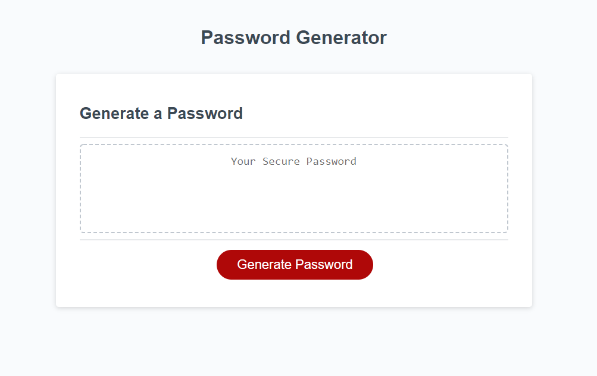

# passGen
Password Generator

Technologies used - HTML, CSS, JavaScript

For an assignment, I was tasked to create the logic behind a password generator using JavaScript.

After clicking "Generate Password" the user is prompted to answer a series of questions - determining criteria for password generation.

As each criteria is determined, the user's choices are added to a "pool" of possible characters to randomize.

If an invalid option is chosen, the user is prompted with messages explaining the error. 

When all criteria are gathered, the password is generated from the pool of chosen characters and the output is displayed to the text area. 

The deployed app can be seen here: https://ubern00bie.github.io/passGen/

Contact info: jbenningfield.dev@gmail.com

## License
 
The MIT License (MIT)

Copyright (c) 2015 Chris Kibble

Permission is hereby granted, free of charge, to any person obtaining a copy of this software and associated documentation files (the "Software"), to deal in the Software without restriction, including without limitation the rights to use, copy, modify, merge, publish, distribute, sublicense, and/or sell copies of the Software, and to permit persons to whom the Software is furnished to do so, subject to the following conditions:

The above copyright notice and this permission notice shall be included in all copies or substantial portions of the Software.

THE SOFTWARE IS PROVIDED "AS IS", WITHOUT WARRANTY OF ANY KIND, EXPRESS OR IMPLIED, INCLUDING BUT NOT LIMITED TO THE WARRANTIES OF MERCHANTABILITY, FITNESS FOR A PARTICULAR PURPOSE AND NONINFRINGEMENT. IN NO EVENT SHALL THE AUTHORS OR COPYRIGHT HOLDERS BE LIABLE FOR ANY CLAIM, DAMAGES OR OTHER LIABILITY, WHETHER IN AN ACTION OF CONTRACT, TORT OR OTHERWISE, ARISING FROM, OUT OF OR IN CONNECTION WITH THE SOFTWARE OR THE USE OR OTHER DEALINGS IN THE SOFTWARE.
